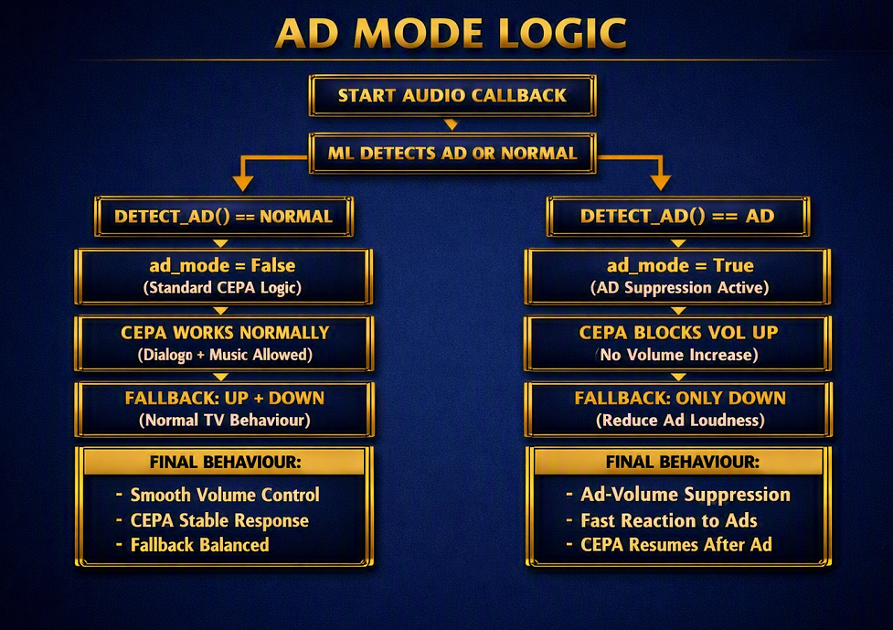

# AD MODE Logic — AdBuster PRO

Poniżej znajduje się pełna logika trybu **AD MODE** w AdBuster PRO.  
To mechanizm odpowiedzialny za wykrywanie reklam i natychmiastowe tłumienie ich głośności, zanim użytkownik odczuje skok audio.

---

## 🔍 Overview

**AD MODE** aktywuje się, gdy ML wykryje reklamę w strumieniu audio.  
System przełącza się w tryb ochronny, blokując wzrost głośności i wymuszając stabilne, komfortowe zachowanie CEPA.

---

## 🟦 NORMAL MODE (brak reklamy)

- `DETECT_AD() == NORMAL`  
- `ad_mode = False`  
- CEPA działa standardowo  
- Dialog + muzyka są dozwolone  
- Fallback: **UP + DOWN**  
- Final behaviour:  
  - Smooth volume control  
  - Stable CEPA response  
  - Balanced fallback

---

## 🟨 AD MODE (wykryta reklama)

- `DETECT_AD() == AD`  
- `ad_mode = True`  
- CEPA blokuje **VOL_UP**  
- Fallback: **ONLY DOWN**  
- Final behaviour:  
  - Ad-volume suppression  
  - Fast reaction to ads  
  - CEPA resumes after ad

---

## 📘 Notes

Ta logika jest kluczowym elementem CEPA 2.0 PRO i stanowi fundament dla stabilnego, przewidywalnego zachowania systemu podczas emisji reklam.

