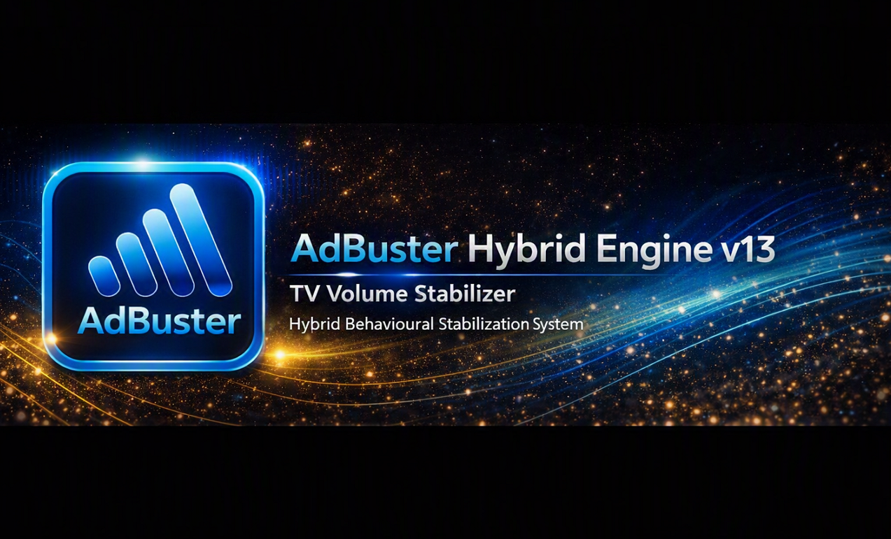

  

# 📘 Hybrid Engine v13 — Overview

Hybrid Engine v13 is the behavioural audio module combining DSP, ML and CEPA logic to deliver human‑like volume control.

---

## 🟦 Core Components

- Real‑time DSP (RMS / STD / DELTA / RANGE)
- 4‑feature ML classifier (AD / MUSIC / DIALOG)
- CEPA behavioural logic
- IR dispatcher (VOL_UP / VOL_DOWN)
- 24/7 backend monitoring

---

## 🟩 CEPA Preset Setup

Hybrid uses a preset system to adapt behaviour to the user’s viewing style.

---

## 🟧 Documentation

### 🔹 Hybrid Engine — Main Document  
[AdBuster_Hybrid_Engine_v13.md](./AdBuster_Hybrid_Engine_v13.md)

### 🔹 CEPA Logic — Signal Flow  
[CEPA Logic-Signal Flow_v13 Hybrid.md](./CEPA%20Logic-Signal%20Flow_v13%20Hybrid.md)

### 🔹 System Report  
[System_Report_13-09-2026.md](./System_Report_13-09-2026.md)

### 🔹 Hybrid Engine Diagram  

---

## 🟪 Notes

> This module is part of AdBuster PRO Hybrid Engine v13.  
> All logs and snapshots are generated automatically during 24/7 operation.

---

 

  

